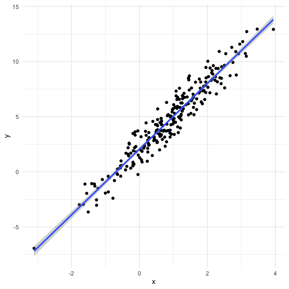
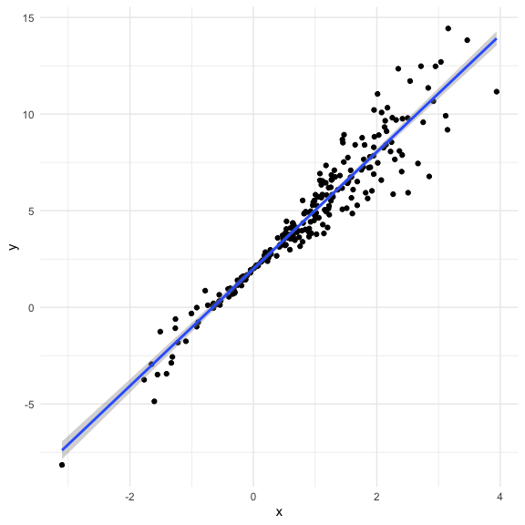
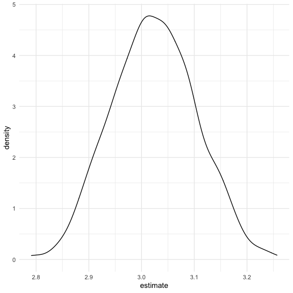

Bootstrapping
================
Nidhi Patel
12/10/2020

``` r
library(tidyverse)
```

    ## ── Attaching packages ─────────────────────────────────────── tidyverse 1.3.0 ──

    ## ✓ ggplot2 3.3.2     ✓ purrr   0.3.4
    ## ✓ tibble  3.0.3     ✓ dplyr   1.0.2
    ## ✓ tidyr   1.1.2     ✓ stringr 1.4.0
    ## ✓ readr   1.3.1     ✓ forcats 0.5.0

    ## ── Conflicts ────────────────────────────────────────── tidyverse_conflicts() ──
    ## x dplyr::filter() masks stats::filter()
    ## x dplyr::lag()    masks stats::lag()

``` r
library(modelr)
library(mgcv)
```

    ## Loading required package: nlme

    ## 
    ## Attaching package: 'nlme'

    ## The following object is masked from 'package:dplyr':
    ## 
    ##     collapse

    ## This is mgcv 1.8-33. For overview type 'help("mgcv-package")'.

``` r
library(p8105.datasets)

knitr::opts_chunk$set(
  fig.width = 6,
  fig.height = 6,
  out.width = "90%")

theme_set(theme_minimal() + theme(legend.position = "bottom"))

options(
  ggplot2.continuous.colour = "viridis",
  ggplot2.continuous.fill = "viridis"
)

scale_colour_discrete = scale_colour_viridis_d
scale_fill_discrete = scale_fill_viridis_d
```

## Simulate data

``` r
n_samp = 250

sim_df_const = tibble(
  x = rnorm(n_samp, 1, 1),
  error = rnorm(n_samp, 0, 1),
  y = 2 + 3 * x + error
)

sim_df_nonconst = sim_df_const %>% 
  mutate(
  error = error * .75 * x,
  y = 2 + 3 * x + error
  )
```

Plot the datasets

``` r
sim_df_const %>% 
  ggplot(aes(x = x, y = y)) +
  geom_point() +
  geom_smooth(method = "lm")
```

    ## `geom_smooth()` using formula 'y ~ x'



``` r
sim_df_nonconst %>% 
  ggplot(aes(x = x, y = y)) +
  geom_point() +
  geom_smooth(method = "lm")
```

    ## `geom_smooth()` using formula 'y ~ x'



``` r
lm(y ~ x, data = sim_df_const) %>% broom::tidy()
```

    ## # A tibble: 2 x 5
    ##   term        estimate std.error statistic   p.value
    ##   <chr>          <dbl>     <dbl>     <dbl>     <dbl>
    ## 1 (Intercept)     1.95    0.0878      22.2 6.72e- 61
    ## 2 x               3.02    0.0626      48.1 7.68e-128

``` r
lm(y ~ x, data = sim_df_nonconst) %>% broom::tidy()
```

    ## # A tibble: 2 x 5
    ##   term        estimate std.error statistic   p.value
    ##   <chr>          <dbl>     <dbl>     <dbl>     <dbl>
    ## 1 (Intercept)     2.06    0.0922      22.3 2.40e- 61
    ## 2 x               2.93    0.0657      44.6 2.38e-120

The assumptions used to build the model are wrong. There is uncertainty
in the estimates. How much? lets figure that out

We see the same amoung of uncertainty in the std.error in both
estimates, but we know there is a difference, one is constant and the
other is nonconstant.

Our assumptions are not met, I need to understand what the distribution
of my sampling should be using repeat sampling under bootstrap.

## Draw one bootstrap sample

``` r
boot_samp = function(df) {
  sample_frac(df, replace = TRUE) %>% 
    arrange(x)
  
}
  #sample_frac(df, replace = TRUE). We are drawing sample with replacement from that df
```

Check if this works

``` r
boot_samp(sim_df_nonconst) %>% 
  ggplot(aes(x = x, y = y)) +
  geom_point(alpha = 0.3) +
  geom_smooth(method = "lm") + 
  ylim(-5, 16)
```

    ## `geom_smooth()` using formula 'y ~ x'


What we get: a df of 250, we get some info and some repeated info
(because it has replacement)

``` r
boot_samp(sim_df_nonconst) %>% 
  lm(y ~ x, data = .) %>% 
  broom::tidy()
```

    ## # A tibble: 2 x 5
    ##   term        estimate std.error statistic   p.value
    ##   <chr>          <dbl>     <dbl>     <dbl>     <dbl>
    ## 1 (Intercept)     2.11    0.104       20.3 1.35e- 54
    ## 2 x               2.89    0.0736      39.3 1.58e-108

## Many samples and analysis

``` r
boot_straps = 
  tibble(
    strap_num = 1:1000,
    strap_samp = rerun(1000, boot_samp(sim_df_nonconst))
  )

#boot_straps %>% pull(strap_samp) %>% .[[3]]
# above line lets us look at the each tible for the rows
```

Can I run my analysis on these\>\>

``` r
boot_results = 
  boot_straps %>% 
  mutate(
    models = map(.x = strap_samp, ~lm(y ~ x, data = .x)), 
    results = map(models, broom::tidy)
  ) %>% 
  select(strap_num, results) %>% 
  unnest(results)
```

What do I have now? Usually, the std error and pvalue are computed under
usual assumptions.

``` r
boot_results %>% 
  group_by(term) %>% 
  summarize(
    mean_est = mean(estimate),
    sd_est = sd(estimate)
  )
```

    ## `summarise()` ungrouping output (override with `.groups` argument)

    ## # A tibble: 2 x 3
    ##   term        mean_est sd_est
    ##   <chr>          <dbl>  <dbl>
    ## 1 (Intercept)     2.06 0.0596
    ## 2 x               2.93 0.0834

Look at distributions: lots of uncertainty here if you tried to lit this
it a linear model

``` r
boot_results %>% 
  filter(term == "x") %>% 
  ggplot(aes(x = estimate)) +
  geom_density()
```



Construct bootstrap CI

``` r
boot_results %>% 
  group_by(term) %>% 
  summarize(
    ci_lower = quantile(estimate, 0.025),
    ci_upper = quantile(estimate, 0.075)
  )
```

    ## `summarise()` ungrouping output (override with `.groups` argument)

    ## # A tibble: 2 x 3
    ##   term        ci_lower ci_upper
    ##   <chr>          <dbl>    <dbl>
    ## 1 (Intercept)     1.94     1.97
    ## 2 x               2.77     2.82

## Bootstrap using `modelr`

Can we simplify anything? yes, obvi

``` r
sim_df_nonconst %>% 
  bootstrap(1000, id = "strap_num") %>% 
  mutate(
    models = map(.x = strap, ~lm(y ~ x, data = .x)), 
    results = map(models, broom::tidy)
  ) %>% 
  select(strap_num, results) %>% 
  unnest(results) %>% 
  group_by(term) %>% 
  summarize(
    mean_est = mean(estimate),
    sd_est = sd(estimate)
  )
```

    ## `summarise()` ungrouping output (override with `.groups` argument)

    ## # A tibble: 2 x 3
    ##   term        mean_est sd_est
    ##   <chr>          <dbl>  <dbl>
    ## 1 (Intercept)     2.06 0.0580
    ## 2 x               2.93 0.0856

These are a little diff bc we’re drawing 1000 samples and they won’t be
the same every time. If we were to write a paper, we would crank up the
iterations a lot.

## Does bootstrap do anything if your assumptions are met? like a reg linear sample?? Yes. If assumptions are true, you can do reg lm stuff and bootstrap stuff

``` r
sim_df_const %>% 
  bootstrap(1000, id = "strap_num") %>% 
  mutate(
    models = map(.x = strap, ~lm(y ~ x, data = .x)), 
    results = map(models, broom::tidy)
  ) %>% 
  select(strap_num, results) %>% 
  unnest(results) %>% 
  group_by(term) %>% 
  summarize(
    mean_est = mean(estimate),
    sd_est = sd(estimate)
  )
```

    ## `summarise()` ungrouping output (override with `.groups` argument)

    ## # A tibble: 2 x 3
    ##   term        mean_est sd_est
    ##   <chr>          <dbl>  <dbl>
    ## 1 (Intercept)     1.95 0.0879
    ## 2 x               3.02 0.0634
