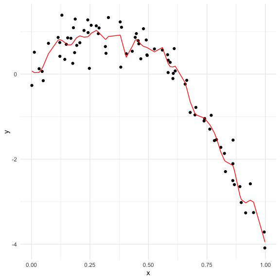
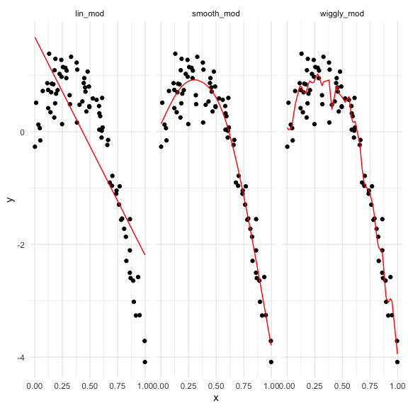

Cross Validation
================
Nidhi Patel
12/9/2020

``` r
library(tidyverse)
```

    ## ── Attaching packages ─────────────────────────────────────── tidyverse 1.3.0 ──

    ## ✓ ggplot2 3.3.2     ✓ purrr   0.3.4
    ## ✓ tibble  3.0.3     ✓ dplyr   1.0.2
    ## ✓ tidyr   1.1.2     ✓ stringr 1.4.0
    ## ✓ readr   1.3.1     ✓ forcats 0.5.0

    ## ── Conflicts ────────────────────────────────────────── tidyverse_conflicts() ──
    ## x dplyr::filter() masks stats::filter()
    ## x dplyr::lag()    masks stats::lag()

``` r
library(modelr)
library(mgcv)
```

    ## Loading required package: nlme

    ## 
    ## Attaching package: 'nlme'

    ## The following object is masked from 'package:dplyr':
    ## 
    ##     collapse

    ## This is mgcv 1.8-33. For overview type 'help("mgcv-package")'.

``` r
library(p8105.datasets)

knitr::opts_chunk$set(
  fig.width = 6,
  fig.height = 6,
  out.width = "90%")

theme_set(theme_minimal() + theme(legend.position = "bottom"))

options(
  ggplot2.continuous.colour = "viridis",
  ggplot2.continuous.fill = "viridis"
)

scale_colour_discrete = scale_colour_viridis_d
scale_fill_discrete = scale_fill_viridis_d
```

## Simulate data

``` r
nonlin_df = 
  tibble(
    id = 1:100,
    x = runif(100, 0, 1),
    y = 1 - 10 * (x - .3) ^ 2 + rnorm(100, 0, .3)
  )
```

Look at data

``` r
nonlin_df %>% 
  ggplot(aes(x = x, y = y)) +
  geom_point()
```


## Cross Validation by hand

Get training and testing datasets

``` r
train_df = sample_n(nonlin_df, size = 80)
test_df = anti_join(nonlin_df, train_df, by = "id") #anti_join takes the remaining data, according to the ID and makes the dataset with it
```

Fit three models

``` r
lin_mod = lm(y ~ x, data = train_df)
smooth_mod = gam(y ~ s(x), data = train_df)
#gam is general additive model coming out of the mgcv package. saying y is a smooth fn of x
wiggly_mod = gam(y ~ s(x, k = 30), sp = 10e-6, data = train_df)
# k tells us hoe specific we want that model to be. we are setting parameters (sp) to something VERY low to make it not smooth at all
```

Can I see what we just did

``` r
train_df %>% 
  add_predictions(wiggly_mod) %>% 
  ggplot(aes(x = x, y = y)) +
  geom_point() +
  geom_line(aes(y = pred), color = "red")
```



Wiggly chases too much. Smooth model does do best in terms of prediction
accuracy.

Can do multiple predictions at the same time:

``` r
train_df %>% 
  gather_predictions(lin_mod, smooth_mod, wiggly_mod) %>% 
  ggplot(aes(x = x, y = y)) +
  geom_point() +
  geom_line(aes(y = pred), color = "red") +
  facet_grid(. ~ model)
```



Look at prediction accuracy. Look at RMSE at testing data set.

``` r
rmse(lin_mod, test_df)
```

    ## [1] 0.7127341

``` r
rmse(smooth_mod, test_df)
```

    ## [1] 0.4324496

``` r
rmse(wiggly_mod, test_df)
```

    ## [1] 0.4904376

Linear: very high, does not fit model at all. Wiggly: still high, not as
bad. Smooth: the best choice. Lowest RMSE.

## Cross Validation using `modelr`

``` r
cv_df = 
  crossv_mc(nonlin_df, 100) # we want 100 cross validations
```

What is happening here? This makes a list of 100 cross validations. We
can pull the test and training df from each and make it a tibble

``` r
cv_df %>% pull(train) %>% .[[1]] %>% as.tibble()
```

    ## Warning: `as.tibble()` is deprecated as of tibble 2.0.0.
    ## Please use `as_tibble()` instead.
    ## The signature and semantics have changed, see `?as_tibble`.
    ## This warning is displayed once every 8 hours.
    ## Call `lifecycle::last_warnings()` to see where this warning was generated.

    ## # A tibble: 79 x 3
    ##       id      x      y
    ##    <int>  <dbl>  <dbl>
    ##  1     5 0.678  -0.159
    ##  2     6 0.0869  0.657
    ##  3     7 0.945  -3.10 
    ##  4     8 0.271   1.39 
    ##  5     9 0.214   0.777
    ##  6    10 0.0883  0.323
    ##  7    11 0.640  -0.526
    ##  8    12 0.944  -2.71 
    ##  9    14 0.637  -0.267
    ## 10    15 0.724  -0.498
    ## # … with 69 more rows

``` r
cv_df %>% pull(test) %>% .[[1]] %>% as.tibble()
```

    ## # A tibble: 21 x 3
    ##       id     x       y
    ##    <int> <dbl>   <dbl>
    ##  1     1 0.362  0.883 
    ##  2     2 0.427  0.0933
    ##  3     3 0.572  0.122 
    ##  4     4 0.251  0.558 
    ##  5    13 0.118  1.00  
    ##  6    16 0.152  1.01  
    ##  7    18 0.191  0.437 
    ##  8    19 0.412  1.04  
    ##  9    25 0.889 -2.42  
    ## 10    28 0.598  0.740 
    ## # … with 11 more rows

We will convert all training and testing data sets and convert to
tibble.

``` r
cv_df = cv_df %>% 
mutate(train = map(train, as_tibble),
       test = map(test, as_tibble))
```

Let’s try to fit models and get RMSEs for them

``` r
cv_df = cv_df %>% 
  mutate(
    linear_mod = map(.x = train, ~lm(y ~ x, data = .x)),
    smooth_mod = map(.x = train, ~gam(y ~ s(x), data = .x)),
    wiggly_mod = map(.x = train, ~gam(y ~ s(x, k = 30), sp = 10e-6, data = .x))) %>% 
# i not have lists containing model info for each of the cross validations. USE map2 for TWO vars going into the map
  mutate(
    rmse_linear = map2(.x = linear_mod, .y = test, ~rmse(model = .x, data = .y)),
    rmse_smooth = map2(.x = smooth_mod, .y = test, ~rmse(model = .x, data = .y)),
    rmse_wiggly = map2(.x = wiggly_mod, .y = test, ~rmse(model = .x, data = .y))
  ) %>% 
   unnest(rmse_linear, rmse_smooth, rmse_wiggly)
```

    ## Warning: unnest() has a new interface. See ?unnest for details.
    ## Try `df %>% unnest(c(rmse_linear, rmse_smooth, rmse_wiggly))`, with `mutate()` if needed

``` r
  #pull(rmse_linear) # this is shows all the rsme for the linear models we are cross validating.
```

What doe these results dae about the model choices?

``` r
cv_df %>% 
  select(starts_with("rmse")) %>% 
  pivot_longer(
    everything(),
    names_to = "model",
    values_to = "rmse",
    names_prefix = "rmse_"
  ) %>% 
  ggplot(aes(x = model, y = rmse)) +
  geom_violin()
```


Among the three models we’re using, the smooth model is doing the best.

Comput averages:

``` r
cv_df %>% 
  select(starts_with("rmse")) %>% 
  pivot_longer(
    everything(),
    names_to = "model",
    values_to = "rmse",
    names_prefix = "rmse_"
  ) %>% 
  group_by(model) %>% 
  summarize(avg_rmse = mean(rmse))
```

    ## `summarise()` ungrouping output (override with `.groups` argument)

    ## # A tibble: 3 x 2
    ##   model  avg_rmse
    ##   <chr>     <dbl>
    ## 1 linear    0.735
    ## 2 smooth    0.319
    ## 3 wiggly    0.376
