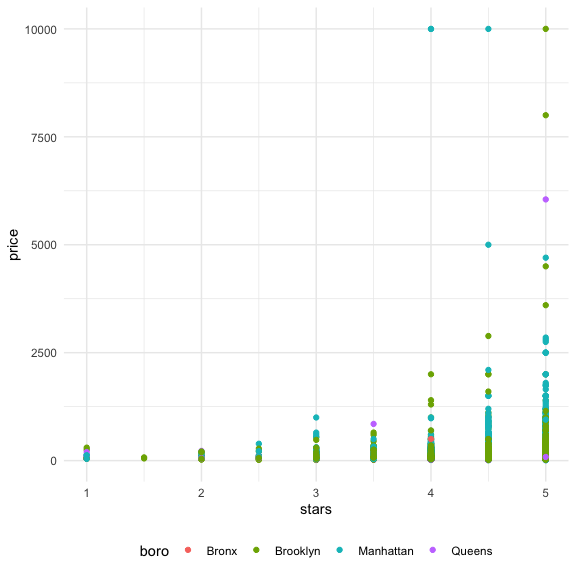
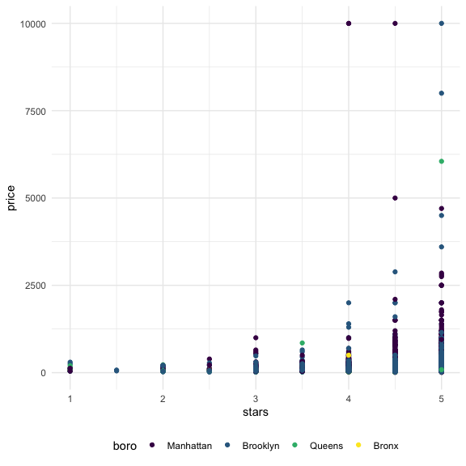

Linear Models
================
Nidhi Patel
12/8/2020

``` r
library(tidyverse)
```

    ## ── Attaching packages ─────────────────────────────────────── tidyverse 1.3.0 ──

    ## ✓ ggplot2 3.3.2     ✓ purrr   0.3.4
    ## ✓ tibble  3.0.3     ✓ dplyr   1.0.2
    ## ✓ tidyr   1.1.2     ✓ stringr 1.4.0
    ## ✓ readr   1.3.1     ✓ forcats 0.5.0

    ## ── Conflicts ────────────────────────────────────────── tidyverse_conflicts() ──
    ## x dplyr::filter() masks stats::filter()
    ## x dplyr::lag()    masks stats::lag()

``` r
library(p8105.datasets)

knitr::opts_chunk$set(
  fig.width = 6,
  fig.height = 6,
  out.width = "90%")

theme_set(theme_minimal() + theme(legend.position = "bottom"))

options(
  ggplot2.continuous.colour = "viridis",
  ggplot2.continuous.fill = "viridis"
)

scale_colour_discrete = scale_colour_viridis_d
scale_fill_discrete = scale_fill_viridis_d
```

## Import data

``` r
data("nyc_airbnb")

airbnb = nyc_airbnb %>% 
  mutate(stars = review_scores_location / 2) %>% 
  rename(
    boro = neighbourhood_group,
    neighborhood = neighbourhood) %>% 
  filter(boro != "Staten Island") %>% 
  select(price, stars, boro, neighborhood, room_type)
```

## Fit a model

We want a line per each borough.

``` r
airbnb %>% 
  ggplot(aes(x = stars, y = price, color = boro)) +
  geom_point()
```

    ## Warning: Removed 9962 rows containing missing values (geom_point).



Let’s fit the model we care about. relating price to starts and boro

``` r
fit = lm(price ~ stars + boro, data = airbnb)
```

Look at the result

Let’s look at the results better

``` r
broom::glance(fit)
```

    ## # A tibble: 1 x 12
    ##   r.squared adj.r.squared sigma statistic   p.value    df  logLik    AIC    BIC
    ##       <dbl>         <dbl> <dbl>     <dbl>     <dbl> <dbl>   <dbl>  <dbl>  <dbl>
    ## 1    0.0342        0.0341  182.      271. 6.73e-229     4 -2.02e5 4.04e5 4.04e5
    ## # … with 3 more variables: deviance <dbl>, df.residual <int>, nobs <int>

``` r
#this produces a tibble, rather than a matrix like the code chunk above

broom::tidy(fit) %>% 
  select(-std.error, -statistic) %>% 
  mutate(
    term = str_replace(term, "borough", "Boro: ")
  ) %>% 
  knitr::kable(digits = 3)
```

| term          | estimate | p.value |
| :------------ | -------: | ------: |
| (Intercept)   | \-70.414 |   0.000 |
| stars         |   31.990 |   0.000 |
| boroBrooklyn  |   40.500 |   0.000 |
| boroManhattan |   90.254 |   0.000 |
| boroQueens    |   13.206 |   0.145 |

## Be in control of factors

In R, the default is for the first categorical variable, alphabetically,
to be the reference class.

Let’s change that. We will change the room type reference variable to be
the most common within the “Room type” var.

``` r
airbnb = airbnb %>% 
  mutate(
    boro = fct_infreq(boro),
    room_type = fct_infreq(room_type))
```

``` r
airbnb %>% 
  ggplot(aes(x = stars, y = price, color = boro)) +
  geom_point()
```

    ## Warning: Removed 9962 rows containing missing values (geom_point).



We see that the model has not changed fundamentally, but reference has
changed

``` r
fit = lm(price ~ stars + boro, data = airbnb)
broom::tidy(fit)
```

    ## # A tibble: 5 x 5
    ##   term         estimate std.error statistic   p.value
    ##   <chr>           <dbl>     <dbl>     <dbl>     <dbl>
    ## 1 (Intercept)      19.8     12.2       1.63 1.04e-  1
    ## 2 stars            32.0      2.53     12.7  1.27e- 36
    ## 3 boroBrooklyn    -49.8      2.23    -22.3  6.32e-109
    ## 4 boroQueens      -77.0      3.73    -20.7  2.58e- 94
    ## 5 boroBronx       -90.3      8.57    -10.5  6.64e- 26

``` r
broom::glance(fit)
```

    ## # A tibble: 1 x 12
    ##   r.squared adj.r.squared sigma statistic   p.value    df  logLik    AIC    BIC
    ##       <dbl>         <dbl> <dbl>     <dbl>     <dbl> <dbl>   <dbl>  <dbl>  <dbl>
    ## 1    0.0342        0.0341  182.      271. 6.73e-229     4 -2.02e5 4.04e5 4.04e5
    ## # … with 3 more variables: deviance <dbl>, df.residual <int>, nobs <int>
