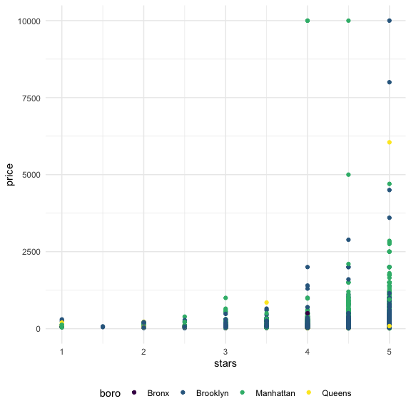

Linear Models
================
Nidhi Patel
12/8/2020

``` r
library(tidyverse)
```

    ## ── Attaching packages ─────────────────────────────────────── tidyverse 1.3.0 ──

    ## ✓ ggplot2 3.3.2     ✓ purrr   0.3.4
    ## ✓ tibble  3.0.3     ✓ dplyr   1.0.2
    ## ✓ tidyr   1.1.2     ✓ stringr 1.4.0
    ## ✓ readr   1.3.1     ✓ forcats 0.5.0

    ## ── Conflicts ────────────────────────────────────────── tidyverse_conflicts() ──
    ## x dplyr::filter() masks stats::filter()
    ## x dplyr::lag()    masks stats::lag()

``` r
library(p8105.datasets)

knitr::opts_chunk$set(
  fig.width = 6,
  fig.height = 6,
  out.width = "90%")

theme_set(theme_minimal() + theme(legend.position = "bottom"))

options(
  ggplot2.continuous.colour = "viridis",
  ggplot2.continuous.fill = "viridis"
)

scale_color_discrete = scale_colour_viridis_d
scale_fill_discrete = scale_fill_viridis_d
```

## Import data

``` r
data("nyc_airbnb")

airbnb = nyc_airbnb %>% 
  mutate(stars = review_scores_location / 2) %>% 
  rename(
    boro = neighbourhood_group,
    neighborhood = neighbourhood) %>% 
  filter(boro != "Staten Island") %>% 
  select(price, stars, boro, neighborhood, room_type)
```

## Fit a model

We want a line per each borough.

``` r
airbnb %>% 
  ggplot(aes(x = stars, y = price, color = boro)) +
  geom_point()
```

    ## Warning: Removed 9962 rows containing missing values (geom_point).



Let’s fit the model we care about. relating price to starts and boro

``` r
fit = lm(price ~ stars + boro, data = airbnb)
```

Look at the result

Let’s look at the results better

``` r
broom::glance(fit)
```

    ## # A tibble: 1 x 12
    ##   r.squared adj.r.squared sigma statistic   p.value    df  logLik    AIC    BIC
    ##       <dbl>         <dbl> <dbl>     <dbl>     <dbl> <dbl>   <dbl>  <dbl>  <dbl>
    ## 1    0.0342        0.0341  182.      271. 6.73e-229     4 -2.02e5 4.04e5 4.04e5
    ## # … with 3 more variables: deviance <dbl>, df.residual <int>, nobs <int>

``` r
#this produces a tibble, rather than a matrix like the code chunk above

broom::tidy(fit) %>% 
  select(-std.error, -statistic) %>% 
  mutate(
    term = str_replace(term, "borough", "Boro: ")
  )
```

    ## # A tibble: 5 x 3
    ##   term          estimate  p.value
    ##   <chr>            <dbl>    <dbl>
    ## 1 (Intercept)      -70.4 5.14e- 7
    ## 2 stars             32.0 1.27e-36
    ## 3 boroBrooklyn      40.5 2.23e- 6
    ## 4 boroManhattan     90.3 6.64e-26
    ## 5 boroQueens        13.2 1.45e- 1
